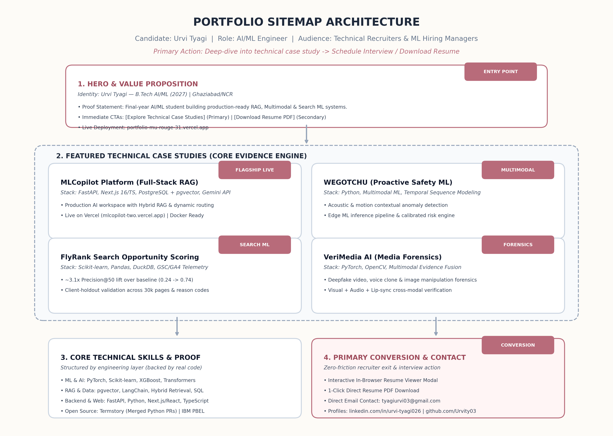
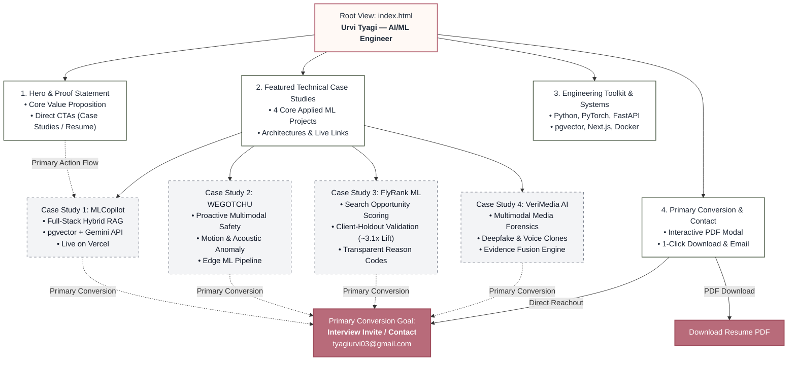

# Portfolio Sitemap: Architecture & User Journey Flow

**Author:** Urvi Tyagi  
**Target Role:** Machine Learning Engineer / Applied AI Engineer (Internship / New Grad)  
**Live Deployment:** [https://portfolio-mu-rouge-31.vercel.app/](https://portfolio-mu-rouge-31.vercel.app/)  
**Primary Audience:** Technical Hiring Managers, Staff/Senior ML Engineers, and Technical AI Recruiters.  
**Primary Action:** Review an in-depth technical case study (problem framing, architecture, code, and live demo) and reach out to schedule an interview (`tyagiurvi03@gmail.com`).  
**Core Proof Statement:**  
> *"Final-year AI & ML undergraduate with proven hands-on capability in designing, building, and deploying production-grade AI systems—ranging from full-stack Hybrid RAG platforms to multimodal safety and search intelligence pipelines—engineered with strict software engineering rigor."*

---

## 1. Visual Sitemap Architecture Diagram





---

## 2. Text-Based Hierarchical Sitemap

```text
/ (Single-Page Dynamic Application with Deep-Dive Routing)
│
├── 1. Hero & Value Proposition (Above the Fold)
│   ├── Proof Statement: Final-year AI/ML student building production-ready RAG, Multimodal & Search ML systems
│   ├── Context Badges: AKTU B.Tech AI/ML (2027) | Ghaziabad/NCR | Open to Relocation/Remote
│   └── Direct Jump CTAs: "Explore Technical Case Studies" (Primary) | "Download Resume PDF" (Secondary)
│
├── 2. Featured Technical Case Studies (The Core Evidence Engine)
│   ├── Case Study 1: MLCopilot Platform (Full-Stack Hybrid RAG Workspace)
│   │   ├── Artifacts: Live Vercel Demo (mlcopilot-two.vercel.app) | GitHub Repo | Architecture Diagram
│   │   └── Stack: Next.js 16/TypeScript, FastAPI backend, PostgreSQL + pgvector, Gemini API, Docker
│   ├── Case Study 2: WEGOTCHU (Proactive Multimodal Personal Safety Intelligence)
│   │   ├── Artifacts: System Architecture | Edge ML Pipeline | Acoustic/Motion Anomaly Engine
│   │   └── Stack: Python, Multimodal ML, Temporal Sequence Modeling, Calibrated Risk Engine
│   ├── Case Study 3: FlyRank Search Opportunity Scoring (Applied Search ML)
│   │   ├── Artifacts: Client-Holdout Validation (~3.1x Precision@50 Lift) | Model Report | Reason Codes
│   │   └── Stack: Scikit-learn, Pandas, DuckDB, GSC/GA4 Telemetry Features
│   └── Case Study 4: VeriMedia AI (Multimodal Digital Media Forensics)
│       ├── Artifacts: Cross-Modal Evidence Fusion Matrix | Deepfake Detection Benchmarks
│       └── Stack: PyTorch, OpenCV, Visual Artifacts + Voice Clone Analysis
│
├── 3. Core Technical Skills & Supporting Proof
│   ├── Machine Learning & AI: PyTorch, TensorFlow, Scikit-learn, XGBoost, Transformers
│   ├── Systems & RAG: pgvector, LangChain, Hybrid Retrieval, SQL, REST APIs, SSE Streaming
│   ├── Backend & Web: Python, FastAPI, Next.js/React, TypeScript, Tailwind CSS, Docker, Linux
│   └── Open Source & Experiential Proof: Termstory (Merged Python PRs) | IBM PBEL | Tata iQ
│
└── 4. Primary Conversion Action & Resume Access
    ├── Interactive In-Browser Resume Viewer Modal (Zero-Download Preview)
    ├── 1-Click Direct Resume PDF Download
    └── Direct Contact Channels: Email (tyagiurvi03@gmail.com) | LinkedIn | GitHub
```

---

## 3. Why Each Section Earns Its Place

Every section in this minimal sitemap is ruthlessly filtered to serve **one target audience** (Technical Hiring Managers / Senior ML Engineers) and facilitate **one primary action** (reviewing technical depth and reaching out for an interview).

| Section | Target Recruiter Question Answered | Rationale & Defense Against Rejection |
|---|---|---|
| **1. Hero & Proof Statement** | *"Who is this candidate and why should I spend 30 seconds reading this?"* | Eliminates vague generic claims ("Passionate Learner"). In under 5 seconds, establishes domain specialization (AI/ML), graduation year (2027), and concrete capabilities with direct jump links. |
| **2. Featured Case Studies** | *"Can they actually build, evaluate, and deploy real ML systems?"* | **The core conversion driver.** Replaces simple bullet points with comprehensive case studies detailing problem framing, data pipelines, client-holdout validation, and live demo links. |
| **3. Technical Stack & Proof** | *"Do they possess the technical tools needed on day one?"* | Structured by technical layer (ML $\to$ RAG/Vector $\to$ Backend $\to$ Full-Stack/DevOps). Every skill listed is backed by an actual project in Section 2, supported by verified open-source PRs (Termstory). |
| **4. Primary Conversion Action** | *"How do I immediately reach out or share this profile with my team?"* | Frictionless exit point: offers in-browser zero-download resume preview, 1-click PDF download, and direct email/LinkedIn contact channels. |

---

## 4. Applied Refinement from Pressure-Test Feedback

Based on the Claude Project pressure-test audit:
* **Pruned Unnecessary Sections:** Removed the standalone "Digital Garden" commit heatmap and separate open-source tabs that introduced visual clutter.
* **Integrated Supporting Proof:** Embedded open-source contributions (Termstory merged PRs) directly within the engineering skills section as supporting evidence.
* **Streamlined Conversion:** Concentrated all recruiter attention on the 4 flagship applied ML projects and direct interview contact.
